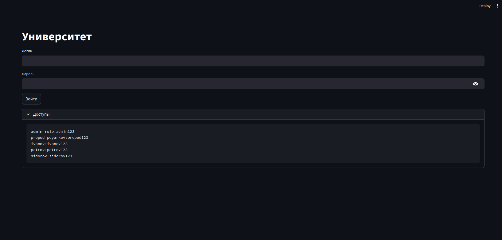
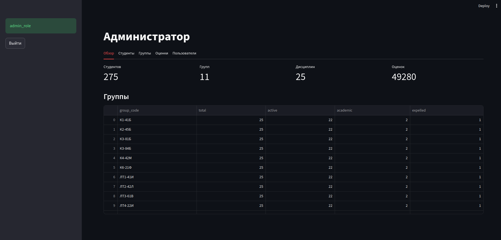
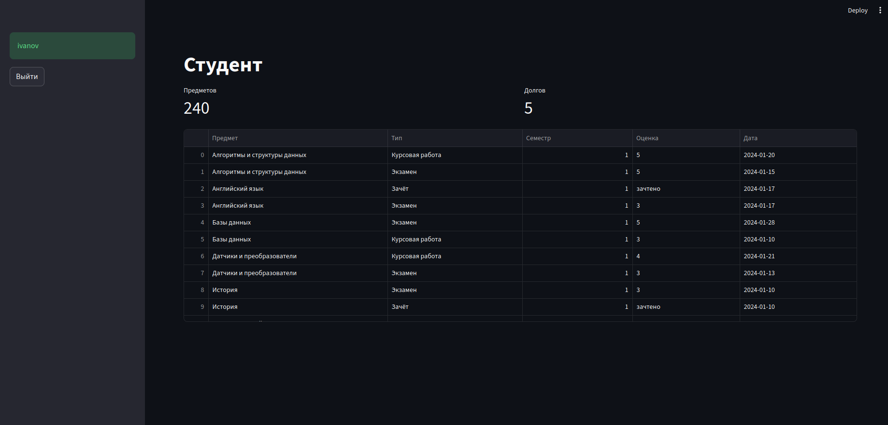
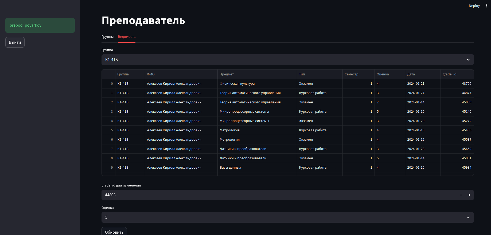
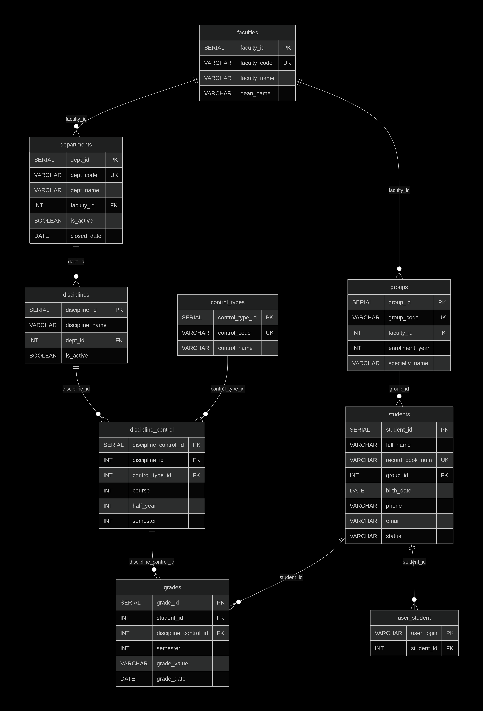
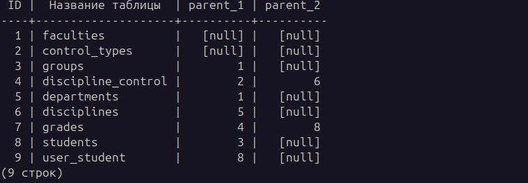

# University Database

**Нормализованная база данных университета (3NF, 8 таблиц) с веб-интерфейсом на Streamlit.**

---

## Возможности

### Управление данными
- Добавление и редактирование факультетов, кафедр, групп, студентов
- Перевод студентов в академ / отчисление с указанием причины
- Soft delete - данные не удаляются физически, история сохраняется

### Учебный процесс
- Учебный план с привязкой дисциплин к семестрам
- Поддержка разных типов контроля: экзамен, зачёт, курсовая, практика
- Оценки с датами сдачи

### Автоматизация
- **Автоматическое определение текущего семестра** по году поступления и текущей дате
- При вставке оценок будущие семестры заполняются как `НА` (не аттестован)

### Безопасность
- Три роли: **админ**, **преподаватель**, **студент**
- Студент видит только свои оценки (через `user_student` + `CURRENT_USER`)
- Преподаватель может менять оценки, но не удалять студентов

### Развёртывание
- Запуск в одну команду через Docker Compose
- Автоматическое создание БД и заполнение тестовыми данными
- Работает на любой ОС без установки PostgreSQL и Python
- Доступ к веб-интерфейсу с любого устройства в локальной сети

---

## Роли и доступы

| **Админ** | `admin_role` | `admin123` | Полный доступ ко всем таблицам |

| **Преподаватель** | `prepod_poyarkov` | `prepod123` | Просмотр студентов и групп, изменение оценок |

| **Студент 1** | `ivanov` | `ivanov123` | Просмотр только своих оценок |

| **Студент 2** | `petrov` | `petrov123` | Просмотр только своих оценок |

| **Студент 3** | `sidorov` | `sidorov123` | Просмотр только своих оценок |






---

## Структура базы данных


### Схема связей:
1:M	faculties → departments

1:M	faculties → groups

1:M	departments → disciplines

1:M	groups → students

M:N	disciplines ↔ control_types

M:N	students ↔ discipline_control

1:1	students ↔ user_student

---

## Граф зависимостей

Автоматическое построение иерархии таблиц через `information_schema` + `WITH RECURSIVE`:


---

## Запуск
```bash
psql -U postgres -f schema.sql
psql -U postgres -f fill_data.sql
pip install -r requirements.txt
streamlit run app.py
```
## Быстрый запуск (Docker) В браузере: http://localhost:8501

```bash
docker compose up
```
---

## Стек
- PostgreSQL 15+
- PL/pgSQL
- Python (Streamlit, psycopg2, pandas)
- Docker / Docker Compose

## Автор
[Kekesruin](https://github.com/Kekesruin)
